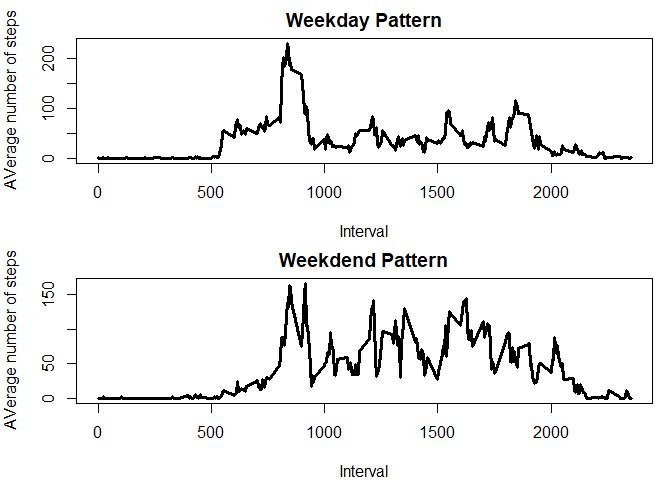

## Loading and preprocessing the data
Below shown in the code for loading various libraries and data into R. A bit of cleanup is also done to analyze data appropriately. The date coloumn is converted to Date class. NA values are ignored initially as well.


```r
library(data.table)
library(ggplot2)

unzip(zipfile="activity.zip")
Data_o<-data.table::fread("activity.csv",col.names=c("steps","date","interval"))
Data_o$date<-as.Date(Data_o$date)
Data<-Data_o[!is.na(Data_o$steps),]
head(Data)
```

```
##    steps       date interval
## 1:     0 2012-10-02        0
## 2:     0 2012-10-02        5
## 3:     0 2012-10-02       10
## 4:     0 2012-10-02       15
## 5:     0 2012-10-02       20
## 6:     0 2012-10-02       25
```


## What is mean total number of steps taken per day?
In this section we calculate the total number of steps taken per day and plot a histogram of the same.


```r
data1<-split(Data,Data$date)
totalsteps<-as.numeric()
for(i in 1:length(data1)){totalsteps[i]<-sum(data1[[i]]$steps)}
hist(totalsteps,breaks=10,col="blue",xlab="Total number of steps",main="Histogram of total number of steps per day")
```

<!-- -->

We also calculate the mean and median of the total number of steps taken per day. They are reported below.


```r
mean_steps<-mean(totalsteps)
median_steps<-median(totalsteps)
mean_steps
```

```
## [1] 10766.19
```

```r
median_steps
```

```
## [1] 10765
```

The mean of the total number of steps taken per day is 10766 and the median is 10765.

## What is the average daily activity pattern?
This particular section shows the graphical representation of average daily steps as a function of time interval.


```r
data2<-with(Data,tapply(steps,interval,mean))
interval<-unique(Data$interval)
plot(interval,data2,type="l",lwd=3,xlab="Time Interval",ylab="Average number of steps",main="Average number of steps per interval")
```

<!-- -->

Below ashown is the interval where maximum number of steps are observed on average.


```r
temp<-data.frame(data2,interval)
head(temp)
```

```
##        data2 interval
## 0  1.7169811        0
## 5  0.3396226        5
## 10 0.1320755       10
## 15 0.1509434       15
## 20 0.0754717       20
## 25 2.0943396       25
```

```r
max_steps<-max(temp$data2)
temp[temp$data2==max_steps,2]
```

```
## [1] 835
```
The interval 835 has the maximum number of average daily steps.

## Imputing missing values
In this section we try to include the data which was initially dis-regarded. Those rows had Na values for steps. Here we try to impute the NA values by using a simple strategy.
We will replace the NA value in steps column by the respective mean value for that particular interval. Later we will analyze its impact in the analysis.


```r
Data_n<-Data_o
for(i in 1:nrow(Data_o))
  {
  if(is.na(Data_o[[1]][i]))
     {
       intr<-temp[[2]][temp$interval==Data_o[[3]][i]]
     Data_n[[1]][i]<-temp[[1]][temp$interval==intr]
    }
}
head(Data_n)
```

```
##        steps       date interval
## 1: 1.7169811 2012-10-01        0
## 2: 0.3396226 2012-10-01        5
## 3: 0.1320755 2012-10-01       10
## 4: 0.1509434 2012-10-01       15
## 5: 0.0754717 2012-10-01       20
## 6: 2.0943396 2012-10-01       25
```

```r
data3<-with(Data_n,tapply(steps,date,sum))
hist(data3,breaks=10,col="red",xlab="Total number of steps",main="Histogram of total number of steps per day with imputed values")
```

<!-- -->

The histogram shown above does not look any different  from the first histogram shown. Lets compute the mean and median values to evaluate the impact of imputing values.


```r
mean_steps_n<-mean(data3)
median_steps_n<-median(data3)
mean_steps_n
```

```
## [1] 10766.19
```

```r
median_steps_n
```

```
## [1] 10766.19
```

As we can see, there is no impact on mean or median values of the new dataset by imputing values based on the partciluar strategy we used.


## Are there differences in activity patterns between weekdays and weekends?
In this section, we deconvulate the date column into another column where specific weekday is specified. This is done using weekdays() function. We then split the data according to weekend or weekday and caluclate respective average number of steps as a function of time interval.


```r
Data_n$weekday<-weekdays(Data_n$date)
Data_n[[4]][Data_n$weekday!="Saturday"&Data_n$weekday!="Sunday"]<-"Weekday"
Data_n[[4]][Data_n$weekday=="Saturday"|Data_n$weekday=="Sunday"]<-"Weekend"
Data_n$weekday<-as.factor(Data_n$weekday)
summary(Data_n)
```

```
##      steps             date               interval         weekday     
##  Min.   :  0.00   Min.   :2012-10-01   Min.   :   0.0   Weekday:12960  
##  1st Qu.:  0.00   1st Qu.:2012-10-16   1st Qu.: 588.8   Weekend: 4608  
##  Median :  0.00   Median :2012-10-31   Median :1177.5                  
##  Mean   : 37.38   Mean   :2012-10-31   Mean   :1177.5                  
##  3rd Qu.: 27.00   3rd Qu.:2012-11-15   3rd Qu.:1766.2                  
##  Max.   :806.00   Max.   :2012-11-30   Max.   :2355.0
```

```r
dt_weekday<-with(Data_n[Data_n$weekday=="Weekday",],tapply(steps,interval,mean))
dt_weekend<-with(Data_n[Data_n$weekday=="Weekend",],tapply(steps,interval,mean))
data_1<-data.frame(dt_weekday,interval)
data_2<-data.frame(dt_weekend,interval)
data_1$week<-"Weekday"
data_2$week<-"Weekend"
par(mfrow=c(2,1),mar=c(4,4,2,1))
plot(data_1$interval,data_1$dt_weekday,type="l",lwd=3,xlab="Interval",ylab="AVerage number of steps",main="Weekday Pattern")
plot(data_2$interval,data_2$dt_weekend,type="l",lwd=3,xlab="Interval",ylab="AVerage number of steps",main="Weekdend Pattern")
```

<!-- -->

From the above plots we see that there is more prolonged activity on weekends as compared to weekdays.
This comparison is useful to analyze daily steps as a function of weekday or weekend.

